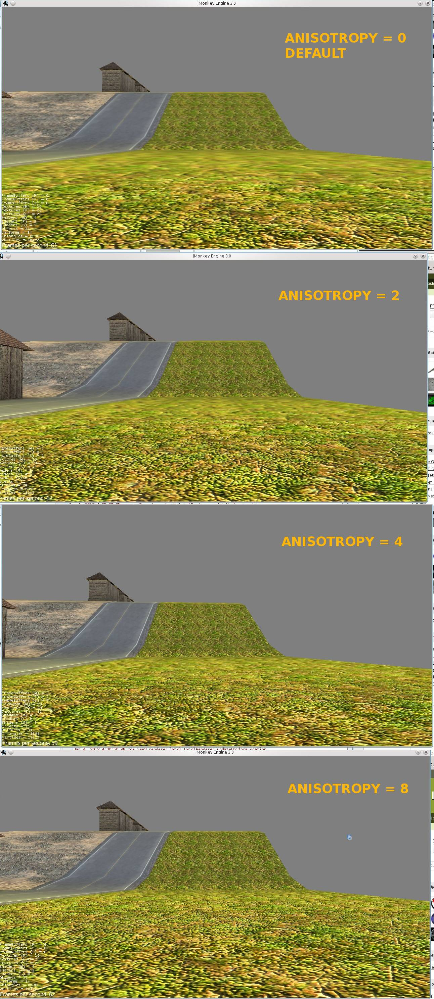

Anisotropic Filtering for Textures
==================================

Anisotropic Filtering is very important for Desktop Games and their
textures. Most games use AnisotropicFiltering = 4/8/16. It sharpens your
textures under different Angle View. Anisotropy makes a performance draw
back about 10-40 fps, but the result looks much better.

See Example: <http://i.imgur.com/0yiv9.jpg>



JME has DEFAULT AnisotropicFiltering = 0. So, if you make a game for
Windows/Linux/Mac.. you need to set the Anisotropic Filtering more than
0.

Example how to set AnisotropicFiltering = 4 for all textures:

```java
        AssetEventListener asl = new AssetEventListener() {
            public void assetLoaded(AssetKey key) {
//                throw new UnsupportedOperationException("Not supported yet.");
            }

            public void assetRequested(AssetKey key) {
                if (key.getExtension().equals("png") || key.getExtension().equals("jpg") || key.getExtension().equals("dds")) {
                    System.out.println(key.getExtension());
                    TextureKey tkey = (TextureKey) key;
                    tkey.setAnisotropy(8);
                }
            }

            public void assetDependencyNotFound(AssetKey parentKey, AssetKey dependentAssetKey) {
//                throw new UnsupportedOperationException("Not supported yet.");
            }
        };

        assetManager.addAssetEventListener(asl);
```
