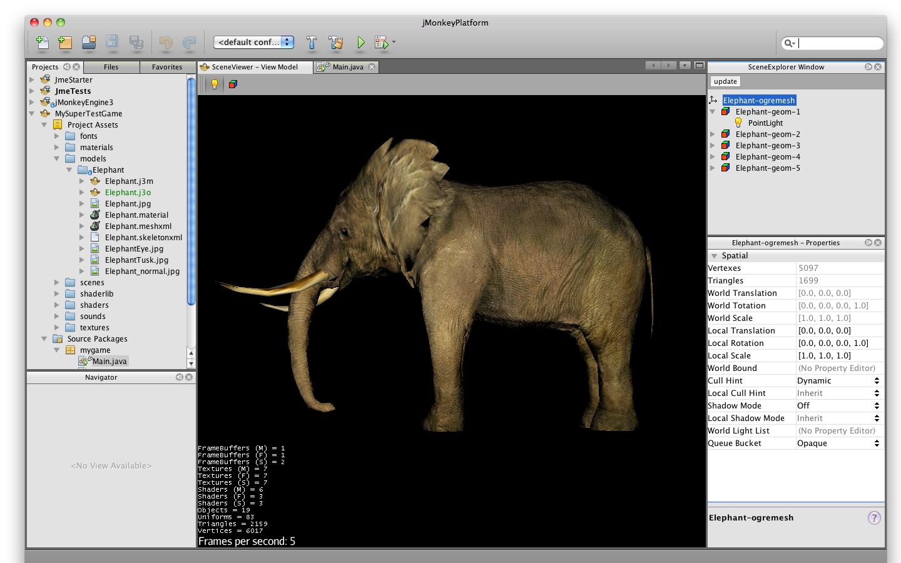
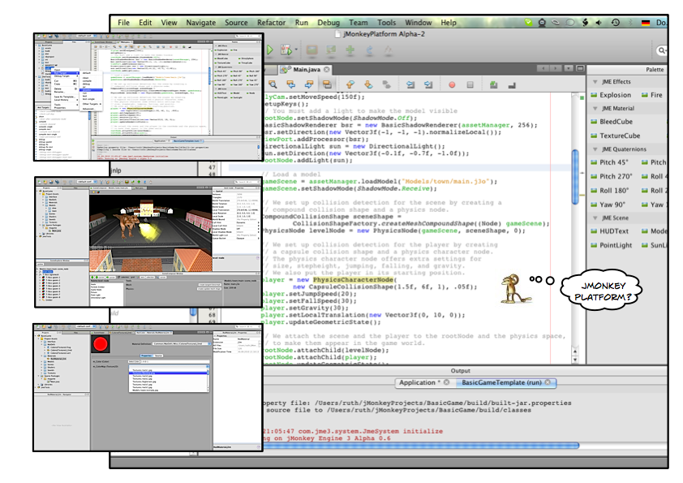

-   IDE stands for Integrated Development Environment. It's a software
    tool for developers.

-   NetBeans IDE, Eclipse, IntelliJ are examples of development
    environments (=IDEs) for developers who are writing Java
    applications.

-   Java is a programming language.

    -   "Java Beans is just a funny way of naming a certain type of data
        object that you can write in Java.\
        (Java = coffee... coffee beans, get it? No, developers aren't
        very funny.)\
        *Java Beans have nothing to do with this topic or NetBeans!*

-   jMonkeyEngine is a game engine written in Java. You use it by
    putting a JAR library on the class path, and calling its API from
    your Java code.

-   The jMonkeyEngine [SDK](../../sdk) (Software Development Kit) is
    a customized NetBeans IDE that has special tools that help you
    develop 3D Java games.

::: {.important}
The writing of the game (the actual game development) is still up to
you, the person using these tools. There is an expectation that you, the
person using these tools, already know how to program in Java.
:::

The Past: A World Without IDEs
==============================

Let's say you have no IDE. The typical stuff that you need for game
development is:

1.  Install the Java SDK ("JDK 6) from Sun/Oracle.

    -   The JDK includes essential development tools, such as the Java
        compiler (`javac`) and Java runtime (`java`).

2.  Install the jMonkeyEngine JAR libraries.

    -   These libraries include the special classes that you need for
        game development.

    -   As with all Java applications, you put JAR libraries on the
        classpath. (`java -cp “bla.jar;foo.jar myapp`...)

3.  Get a text editor to write .java and .xml files.

4.  Get a 3D model editor to preview 3D models and arrange them in
    scenes.

5.  Create Java project:

    a.  create directories for Java packages,

    b.  create more directories for textures and sound files and 3D
        models,

    c.  write an Ant build script,

    d.  move JAR files around and check the classpath...

6.  Write code:

    a.  write code in text editor,

    b.  look up javadoc in the web browser,

    c.  compile and then run code in the terminal,

    d.  when you get error output in the terminal, go find the file and
        line back in text editor...

7.  Repeat.

Basically, you switch back and forth between terminal, 3D model editor,
web browser, and text editor a lot. You have to repeat lots of manual
fine-tuning for every new file and project.

Some people got annoyed by these maintenance tasks, and that's why they
invented the IDE.

The Present: The world with IDEs
================================

An IDE is a source code editor that developers use to write applications
and manage projects. It replaces the text editor -- and all the
switching between browser and terminal and text editors. The essential
word here is **integrated**: An IDE integrates all development tools
(listed above) in one window.

-   There are New Project and New File menu items that create
    directories and packages. It creates a professional Ant script. It
    manages the classpath for you. These formerly manual tasks are
    always the same for you -- now they are automated in the "Project
    window.

-   The "Editor window lets you edit Java and XML files. (more details
    below)

-   You can drag and drop commonly used code snippets from a "Palette
    window into your Java files.

-   A "Navigator window gives you a quick overview of long Java classes,
    and lets you jump to methods and fields.

-   The Build button starts the JDK6 compiler (`ant` and `javac`), the
    Clean button runs `ant clean`, the Run button runs the application
    (`ant run` and `java`) -- all these tasks are now once-click actions
    in a toolbar or context menu.

-   After building and running, the IDE opens the "Application window.
    This window is what end-users of your applications will see. Here
    you can test your gameplay.

**The Editor** is the heart of the IDE, and it has tons of great
additional capabilties:

-   The IDE tries to compile in the background what you write in the
    Editor. If you made a horrible, but obvious, mistake (forgot
    semicolon, mixed up data types, made a typo in a method call...) it
    tells you so immediately through warning colors and icons. This is
    called syntactic and semantic code highlighting.

    -   You still get Terminal output for errors and warnings (in the
        "Output window inside the IDE), but this way you erradicate tiny
        typos and compiletime errors immediately, and you can focus on
        serious runtime errors in the Output window.

-   The number of commands in the Java API is limited. So while you type
    a method or class name, there is only a limited number of things it
    can be. If you temporarily forgot what a method was called, the
    Editor pops up a list of options (plus javadoc comments), and you
    can simply select it.

-   Similarly, every class and method only has a limited number of
    arguments. Again, the IDE pops up a list of expected arguments, so
    you don't need to search for them in the javadoc.

Your Future: A World With jMonkeyEngine SDK
===========================================

The jMonkeyEngine SDK is the same as NetBeans IDE, plus

-   The New Project Wizards automatically adds the jMonkeyEngine
    libraries on the classpath and creates a build script.

-   The javadoc popup dispalys Standard Java and jMonkeyEngine APIs in
    the editor.

-   The Palette contains special code snippets from the jMonkeyEngine
    API for loading and saving 3D objects, input handling, nodes,
    lights, materials, rotation constants, etc.

-   The Projects, SceneComposer, and SceneExplorer windows let you
    convert, preview, and arrange 3D models before you load them in your
    Java code.

-   And more...

You see how such a unique IDE can speed up your development process
drastically, it's worth giving it a try!

-   [Video: jMonkeyEngine3 -
    Intro](http://www.youtube.com/watch?v=cTErYjsJ_Yk)

-   [jMonkeyEngine SDK - the Comic](../../sdk/comic)
