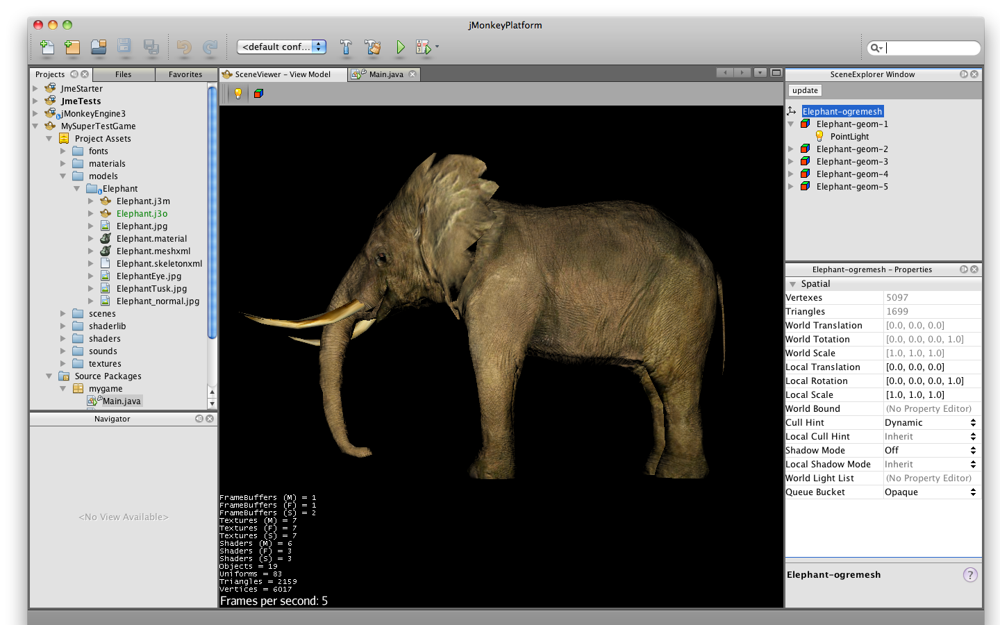
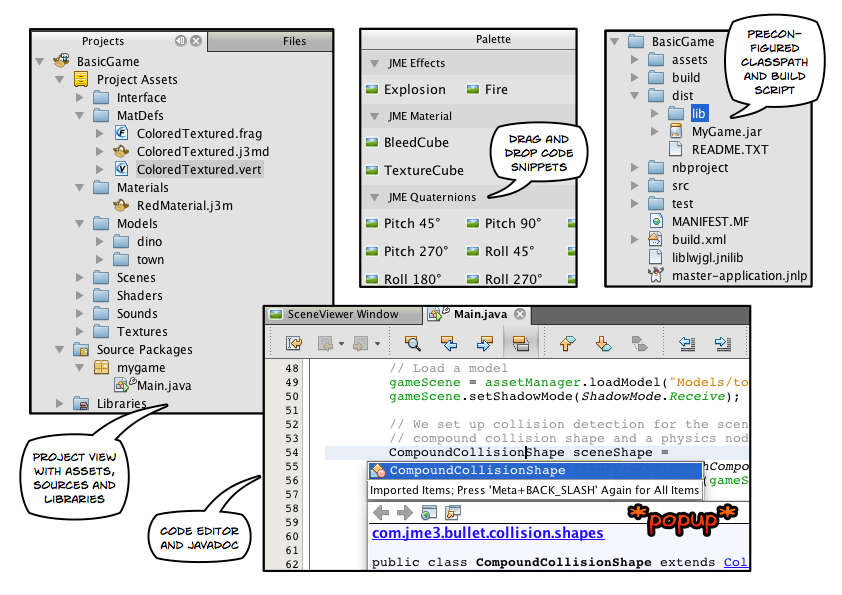
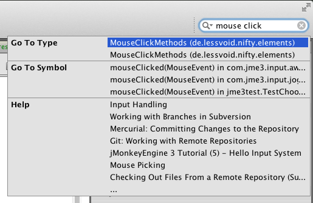
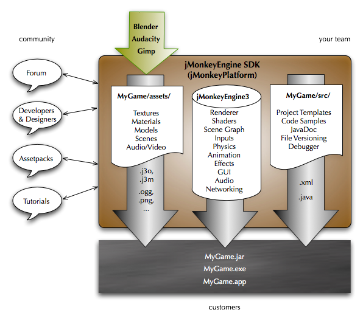

# Why jMonkeyEngine SDK?

The jMonkeyEngine SDK (software development kit) is the recommended game
development environment for the jMonkeyEngine 3 library.

The jMonkeyEngine SDK is an integrated development environment (IDE)
that provides you with unique plugins for creating jMonkeyEngine 3 game
content. You can [download and install the jMonkeyEngine
SDK](https://github.com/jMonkeyEngine/sdk/releases/tag/3.1-stable-FINAL)
as a ready-to-use complete game development environment, rather than
using a generic Java IDE. ([What’s an
IDE](jme3/beginner/what_s_an_ide)?)

Since the jMonkeyEngine SDK is based on the [NetBeans
Platform](http://platform.netbeans.org/) ([Why not Eclipse
RCP?](sdk/whynoteclipse)), you have access to all of the developer
tools in the [NetBeans IDE](http://www.netbeans.org/), including a wide
variety of deployment formats ranging from browser Applet and WebStart
to desktop executables. Although we recommend the jMonkeyEngine SDK,
experienced users can work with the jMonkeyEngine JARs in their favorite
IDE, and choose to only use the jMonkeyEngine SDK to manage assets and
JME3 binaries.

Go to `Settings Keymap` and choose your favorite keyboard profile:
NetBeans default, Eclipse, IntelliJ, or others.

## Documentation

To get help and code samples right in the SDK, press `F1`, or press
`Ctrl` + `i` to enter a query in the super search box (top right)\!

The built-in help system lets you browse a local copy of the
documentation pulled from this wiki. It also contains code samples and
info about installed plugins and generic IDE features.

# All Features and Usecases

## Video Tutorials

**SDK Use Case Tutorials**

  - [Video: jMonkeyEngine SDK Use Case Demo 1 (Quixote
    demo)](http://www.youtube.com/watch?v=-OzRZscLlHY)

  - [Video: jMonkeyEngine SDK Use Case Demo 2 (Models and
    Materials)](http://www.youtube.com/watch?v=6-YWxD3JByE)

**SDK Tutorials**

  - [Video: jMonkeyEngine SDK -
    Basics](http://www.youtube.com/watch?v=M1_0pbeyJzI)

  - [Video: jMonkeyEngine SDK - Importing
    Models](http://www.youtube.com/watch?v=nL7woH40i5c)

  - [Video: jMonkeyEngine SDK - Dragging\&Dropping
    Nodes](http://www.youtube.com/watch?v=DUmgAjiNzhY)

  - [Video: jMonkeyEngine SDK - Scene
    Composing](http://www.youtube.com/watch?v=ntPAmtsQ6eM)

  - [Video: jMonkeyEngine SDK - Terrain with Collision
    Shape](http://www.youtube.com/watch?v=zgPV3W6dD4s)

  - [Video: jMonkeyEngine SDK - Working with
    Materials](http://www.youtube.com/watch?v=Feu3-mrpolc)

  - [Video: jMonkeyEngine SDK - Custom
    Controls](http://www.youtube.com/watch?v=MNDiZ9YHIpM)

  - [Video: WebStart
    Deployment](http://www.youtube.com/watch?v=oZnssg8TBWQ)

  - [Video: Animation and Effect
    TrackEditing](http://www.youtube.com/watch?v=D7JM4VMKqPc)

  

## SDK User Guide

**Getting Started**

  - [Updating jMonkeyEngine SDK](sdk/update_center)

  - [Troubleshooting](sdk/troubleshooting)

**Generic Java Development Features**

  - [Project Creation](sdk/project_creation)

  - [Code Editor and Palette](sdk/code_editor)

  - [File Version Control](sdk/version_control)

  - [Application Deployment (JAR, WebStart, Applet,
    Android)](sdk/application_deployment)
    
      - [Default Build Script](sdk/default_build_script)
    
      - [Android](jme3/android)
    
      - [iOS](jme3/ios)

  - [Debugging, Profiling, Testing](sdk/debugging_profiling_testing)

**Unique Game Development Features**

  - [Importing, Viewing, and Converting
    Models](sdk/model_loader_and_viewer)
    
      - [Asset Packs](sdk/asset_packs)

  - [The SceneExplorer](sdk/scene_explorer)

  - [Composing a Scene](sdk/scene_composer)

  - [Terrain Editor](sdk/terrain_editor)

  - [Sample Code](sdk/sample_code)

  - [Material Editing](sdk/material_editing)

  - [Creating Bitmap Fonts](sdk/font_creation)

  - [Audio and Effect Track
    Editing](https://hub.jmonkeyengine.org/t/effecttrack-and-audiotrack-editing-in-the-sdk/23378)
     
    
      - [Video: Effect and AudioTrack editing in jMonkeyEngine 3
        sdk](https://www.youtube.com/watch?v=D7JM4VMKqPc)

  - [Post-Processor Filter Editor and Viewer](sdk/filters)

  - [Application States](jme3/advanced/application_states)

  - [Custom Controls](jme3/advanced/custom_controls)

  - [Vehicle Creator](sdk/vehicle_creator)

jMonkeyEngine SDK is continuously being improved. Check out this link
for a list of changes and improvements for the future: [changes and
improvements for the
future](https://github.com/jMonkeyEngine/jmonkeyengine/issues/198)

# Advanced Usage

  - [Using your own (modified) version of jME3 in jMonkeyEngine
    SDK](sdk/use_own_jme)

  - [Create a custom model importer](sdk/development/model_loader)

  - [Log Files](sdk/log_files)

  - [Increasing Heap Memory](sdk/increasing_heap_memory)

# Available external plugins

  - [Contributions](jme3/contributions)

  - [Neo Texture Editor for procedural textures](sdk/neotexture)

  - [Video: Mesh Tool & Physics
    Editor](http://www.youtube.com/watch?v=yS9a9o4WzL8)

  - And more…

## Development

  - [Building jMonkeyEngine SDK](sdk/build_platform)

  - [Developing plugins for jMonkeyEngine SDK](sdk/development)

## Status and Roadmap

See [this page on
GitHub](https://github.com/jMonkeyEngine/jmonkeyengine/labels/roadmap)
for links to up-to-date info on current status and features.

# A Little Bit of History

The jMonkeyEngine SDK first set root during a discussion with Normen
Hansen. Although similar projects existed previously, this was the first
serious attempt that had the original core team’s blessing. For some
time, the project was referred to merely as the Game Development
Environment, or "GDE" for short. During alpha, we referred to it as
jMonkeyPlatform, and for beta it was eventually renamed to the
jMonkeyEngine SDK.
